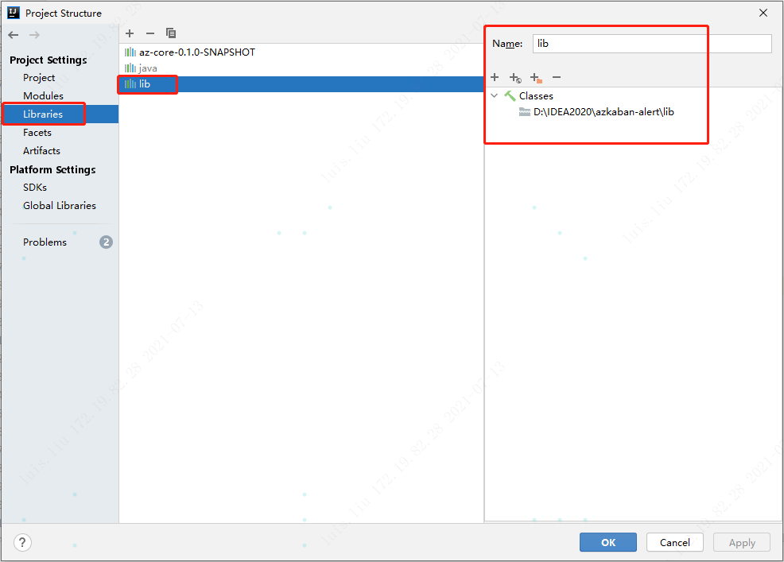
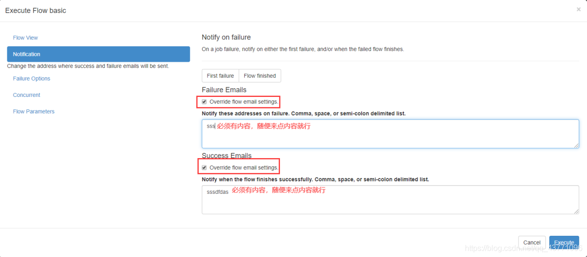
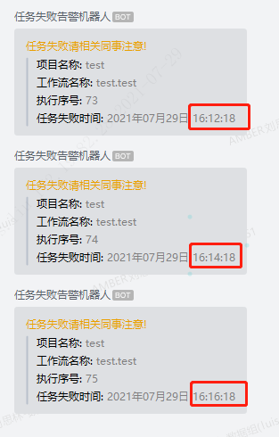

# 项目说明

本项目为azkaban的自定义报警功能

- 邮箱报警(默认)
- 企业微信报警
- 钉钉报警
- 电话报警

# 引用外部lib包



# 部署方式

- 将项目打jar包
- 注册睿象云账号：https://newuser.aiops.com/ 个人亲测，免费有几条的额度，可用，如果是企业生产，就买吧
- 可以使用PostMan测试一下发送post请求，会打电话，会发短信，发邮件等
- 新建/opt/module/azkaban/azkaban-web-server-3.84.4/plugins/alerter/wechat-alerter文件夹，并在内部新建conf和lib两个目录(网上各种复制粘贴，plugin没有带s恶心)
```shell
mkdir -p /opt/module/azkaban/azkaban-web-server-3.84.4/plugins/alerter/wechat-alerter/conf 
mkdir -p /opt/module/azkaban/azkaban-web-server-3.84.4/plugins/alerter/wechat-alerter/lib
```
- 在新建的 wechat-alerter/conf目录里，新建plugin.properties
```shell
#name一定要设置email，用以覆盖默认的邮件报警
alerter.name=email
alerter.external.classpaths=lib
alerter.class=com.yangtzelsl.WeChatAlerter
#这两个参数和你使用的AlertAPI有关系!!!!!!
# appKey为自己睿象云申请的key
# url为睿象云提供的url地址
# 发送的主题内容在代码的部分有体现
my.alert.appKey=f10c90ac-c768-f2db-xxxx-a056f922350d
my.alert.url=http://http://api.aiops.com/alert/api/event
```
- 代码打jar包后，上传到/opt/module/azkaban/azkaban-web-server-3.84.4/lib文件夹(不确定是上传到$web_home/lib还是./plugins/alerter/wechat-alerter/lib下，我都试过，没成功)
- 重启web服务(假定生产环境已经启动了azkaban，且之前没有集成自定义告警)
- azkaban告警处设置通知，随便设置点内容，实际会采用睿象云覆盖

  
- 失败了，各种方式都尝试了，还是没理解深层次原理()
- 在web页面配置alert.type=wechat-alerter也试过，报错
```shell
2021/07/15 12:36:56.266 +0000 ERROR [ExecutionControllerUtils] [ExecutorManagerUpdaterThread] [Azkaban] Alerter type wechat-alerter doesn't exist. Failed to alert.
```

# 结尾
以上项目整合azkaban没成功，单独测试第三方告警平台没问题，要花钱！，企业微信机器人，钉钉机器人也没问题。
如果想使用企业微信或钉钉机器人，睿象云免费版不支持，需要收费版

# 其它思路

- 假如具有企业微信或钉钉机器人的创建权限(没有权限找有权限的人创建即可)，可以创建一个机器人

- 企业微信机器人API参考文档：https://work.weixin.qq.com/api/doc/90000/90136/91770
- 钉钉机器人API参考文档：https://developers.dingtalk.com/document/app/custom-robot-access

- 注意保护好自己的webhook地址(防止信息轰炸)

- 使用PostMan测试能否接收消息

- 将对应的配置文件的appKey替换为webhook的key

- 将对应的url的地址替换为企业微信api地址

- 该方式本人测试集成到azkaban中，始终没有成功，有成功的请指教

# 流程

步骤拆解

- 使用postman或curl测试告警api(机器人等)是否可用(成功!)
- 转换成java程序(或python程序)发送告警，看是否成功(成功!)
- 将转换的程序集成到azkaban Alert接口中去，并打包作为插件(就这步集成，废了老大劲，老是不成功，绝望!!!)

# 20210729更新

- 经过多次尝试，在源码上打日志，重新编译，最终成功了，相关坑记录如下
- 在启动exex和web的时候，一定要在对应的家目录下，因为设计插件路径查找问题，且是相对路径，如
```shell
[hadoop@ip-10-132-58-73 azkaban-web-server]$ pwd
/opt/azkaban-3.91.0/azkaban-web-server

[hadoop@ip-10-132-58-73 azkaban-web-server]$ ll
total 640
drwxr-xr-x 4 hadoop hadoop   4096 Jul 28 10:12 bin
drwxr-xr-x 2 hadoop hadoop    106 Jul 29 06:56 conf
-rw-rw-r-- 1 hadoop hadoop      6 Jul 29 07:44 currentpid
-rw-r--r-- 1 hadoop hadoop   2232 Jul 28 08:04 keystore
drwxr-xr-x 2 hadoop hadoop   8192 Jul 28 09:56 lib
drwxr-xr-x 3 hadoop hadoop     21 Jul 28 08:20 plugins
drwxrwxr-x 2 hadoop hadoop      6 Jul 28 10:06 temp
drwxr-xr-x 6 hadoop hadoop     73 Jul 28 03:55 web

# 一定要在这个路径启停,别问为什么，看源码，踩坑
[hadoop@ip-10-132-58-73 azkaban-web-server]$ ./bin/start-web.sh

[hadoop@ip-10-132-58-73 azkaban-web-server]$ ./bin/shutdown-web.sh
```

- 启停ok之后，
```shell
[hadoop@ip-10-132-58-73 azkaban-web-server]$ cat plugins/alerter/wechat/conf/plugin.properties 
# 这里别用email,注册的插件名叫啥，这里就用啥，比如我叫wechat
alerter.name=wechat
# 这里就写lib，是相对路径，不要用绝对路径，自己打的包就丢在这个路径下
# 可以是带依赖的包，也可以不带依赖，如果不带依赖就把用到的依赖包都放在这里
alerter.external.classpaths=lib
# 这里是自己的类名
alerter.class=com.yangtzelsl.WeChatAlerter
alert.wechatKey=这里写微信机器人的key
```

- 目前在azkaban 3.91.0 测试成功，其它低版本暂时不知道适不适应，源码只打了日志，看启动流程，没有做核心更改

- 在web 页面配置定时调度，每次都要配置alert.type=wechat,试过在配置文件里面配置，不生效（但是其实定时调度配一次就行了，也不麻烦）

- 发企业微信机器人告警，可以用curl也可以用http，测试http时可能写法有故障，故障原因在代码有体现，后来干脆改成 curl + markdown 格式

- 告警效果（终于实现，开心）



# 20210823更新

- 本次实现任务超时，机器人告警

- 说明：任务超时告警，即SLA设置，应该对Azkaban的版本有要求，笔者使用的版本为 3.91.0，可以实现超时告警，之前使用过老版本的，不能超时告警
参考：https://github.com/azkaban/azkaban/issues/1363
  
- 是否启用了超时告警，可以在web页面查看到

  
- 正常如果启用了SLA(在配置文件没有看到该配置，官方文档也没有查看到，估计是直接写在源码中，吐槽一波，文档确实太烂)，并且在web页面配置了SAL
则，has sla = true，否则体现为false